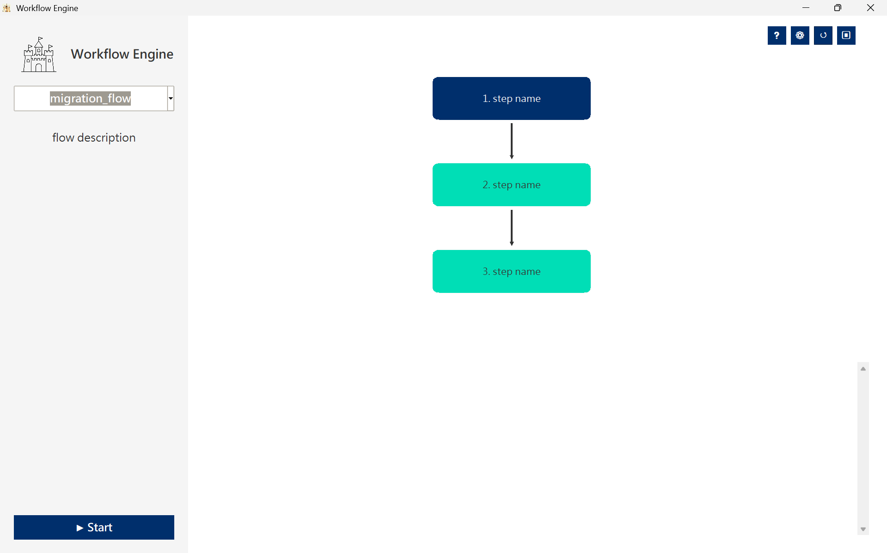

# Workflow Engine

A powerful, visual workflow management system built with Python and Tkinter. This tool allows you to organize, visualize, and execute complex sequences of Python scripts with ease. Designed with a clean **MVP (Model-View-Presenter)** architecture, it provides a robust foundation for task automation.



## 🚀 Key Features

*   **Visual Workflow Visualization**: Dynamically renders workflow steps as a flowchart based on JSON configuration.
*   **Real-time Execution Monitoring**:
    *   Watch your scripts run step-by-step.
    *   Node colors change in real-time to reflect status: **Pending**, **Running**, **Finished**, **Error**, or **Skipped**.
    *   Live stdout log streaming from subprocesses directly to the UI.
*   **Interactive Control**:
    *   **Start from Anywhere**: Click any node to start the flow from that specific step.
    *   **Graceful Stop**: Pause or stop execution safely.
    *   **Breakpoints**: Click on connecting lines to "cut" the flow. Execution will automatically stop when it reaches a cut line.
*   **Zoom & Pan Canvas**: Seamlessly navigate large workflows with mouse wheel zoom and right-click drag panning.
*   **MVP Architecture**: Clean separation of concerns (Model, View, Presenter) for easy maintenance and scalability.

## 🛠️ Usage

### 1. Prerequisites

*   Python 3.x
*   Tkinter (usually included with Python)

### 2. Installation

Clone the repository:

```bash
git clone https://github.com/yourusername/workflow-engine.git
cd workflow-engine
```

### 3. Running the Application

Run the main entry point:

```bash
python main.py
```

### 4. Configuration

The workflows are defined in `configs/config.json`. You can easily add your own tasks.

**Structure of `configs/config.json`:**

```json
{
  "your_flow_key": {
    "title": "My Awesome Automation",
    "description": "A brief description of what this flow does.",
    "steps": [
      {
        "name": "Step 1: Check Env",
        "module": "check_env", 
        "overview": "Checks network connection."
      },
      {
        "name": "Step 2: Sync Data",
        "module": "data_sync",
        "overview": "Syncs data from API."
      }
    ]
  }
}
```

*   **`module`**: Corresponds to the Python script filename in the `tasks/` directory (e.g., `"module": "check_env"` runs `tasks/check_env.py`).
*   **`tasks/` Directory**: Place your Python scripts here. The engine executes them as subprocesses.

## 🏗️ Architecture

This project follows the **Model-View-Presenter (MVP)** pattern:

*   **Model (`model.py`)**: Manages the application state (current flow, execution status, configurations) and business logic rules.
*   **View (`view.py`)**: Handles the UI rendering using `tkinter`. It draws the canvas, nodes, and updates the log area. It is passive and forwards user actions to the Presenter.
*   **Presenter (`presenter.py`)**: Acts as the bridge. It receives user inputs from the View, updates the Model, and triggers UI updates. It handles the threading and subprocess management for running scripts.
*   **Main (`main.py`)**: The entry point that assembles the MVP tripod.

## 📂 Project Structure

```
├── main.py              # Application entry point
├── model.py             # Data and state management
├── view.py              # UI implementation (Tkinter)
├── presenter.py         # Application logic and mediation
├── view_setting.py      # Settings window UI
├── view_help.py         # Help window UI
├── resource_helper.py   # Resource path handling
├── configs/             # Configuration files
│   ├── config.json      # Workflow definitions
│   └── global_config.json
├── tasks/               # Directory for your Python task scripts
└── build.bat            # Build script
```

## 📝 License

This project is open source and available under the [MIT License](LICENSE).
